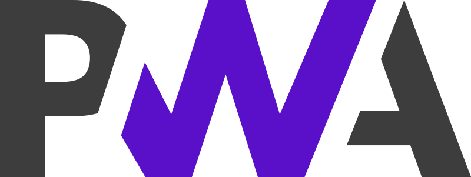
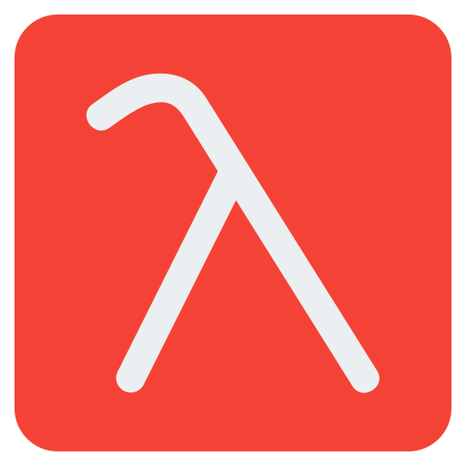

<!-- animation start  -->
<!--  -->
<!-- animation end  -->
<!--  -->

<!--
<video src='./myAssets/gh-banner-video.mp4' muted autoplay/> -->

<h2 align="center">In the world of bits and bytes, where art meets science, I found my passion 
As code is my canvas for crafting masterpieces!</h2>

<!--  -->

	A young and enthusiastic individual Making Code Beneficial who also likes to Develop, Design, Innovate, Experiment and take up new challenges with long exited journey to go. He thinks
	in a pragmatic way and is always learning new skills and applying those skills in practical life is a great delight.
	Keeps a strong eye for clean, efficient and secure coding practices and has keen understanding of Logic Building.
	Unlikely others loves BackEnd Technicalities and Competitive Programming(C++) is his Hobby. He also loves meeting
	new people, exchanging ideas and spreading knowledge and positivity other than that he could be found helping others
	learn Programming. Seeks to join a dynamic and progressive organization offering ample opportunities and diversified
	exposure where he could enhance his experience.

| Currently Learning | DSA, NestJs |
| ------------------ | ----------- |

	<a href="https://shehzad.vercel.app/" align="center" target="_blank"
		style="font-size:2rem; letter-spacing:0.3rem; font-weight:800; text-align:center; border:2px solid">MY PERSONAL
		PORTFOLIO WEBSITE</a>

<h3 align="left">📫 Connect with me on 🔗 :</h3>

	
	
	
	
	
	
	
	

<h3 align="left">Languages and Tools ⚙️ : </h3>

 

	<!--  -->

<h3 align="left">🏫 Plans of Learning :</h3>

	
	
	<!-- 
	 -->
	<!--  -->

 

<!-- 

	

	

 -->

	<h3> ✍️ Random Dev Quote </h3>
	

 

## Recent Activity

<!--START_SECTION:activity-->

1. 🎉 Merged PR [#9](https://github.com/shehza-d/smit-hackathons/pull/9) in [shehza-d/smit-hackathons](https://github.com/shehza-d/smit-hackathons)
2. 🎉 Merged PR [#8](https://github.com/shehza-d/smit-hackathons/pull/8) in [shehza-d/smit-hackathons](https://github.com/shehza-d/smit-hackathons)
3. 🎉 Merged PR [#7](https://github.com/shehza-d/smit-hackathons/pull/7) in [shehza-d/smit-hackathons](https://github.com/shehza-d/smit-hackathons)
4. 🎉 Merged PR [#24](https://github.com/shehza-d/portfolio/pull/24) in [shehza-d/portfolio](https://github.com/shehza-d/portfolio)
5. 💪 Opened PR [#24](https://github.com/shehza-d/portfolio/pull/24) in [shehza-d/portfolio](https://github.com/shehza-d/portfolio)
6. 🎉 Merged PR [#23](https://github.com/shehza-d/portfolio/pull/23) in [shehza-d/portfolio](https://github.com/shehza-d/portfolio)
<!--END_SECTION:activity-->

 

<h2> GitHub Statistics :zap: :
	<h2 />
	 
	

		 
	<h2 align="center">Time spent on Coding evidence! (WakaTime)</h2>
	

		
		 
		
		  
		
		   
		
		   
		
	

